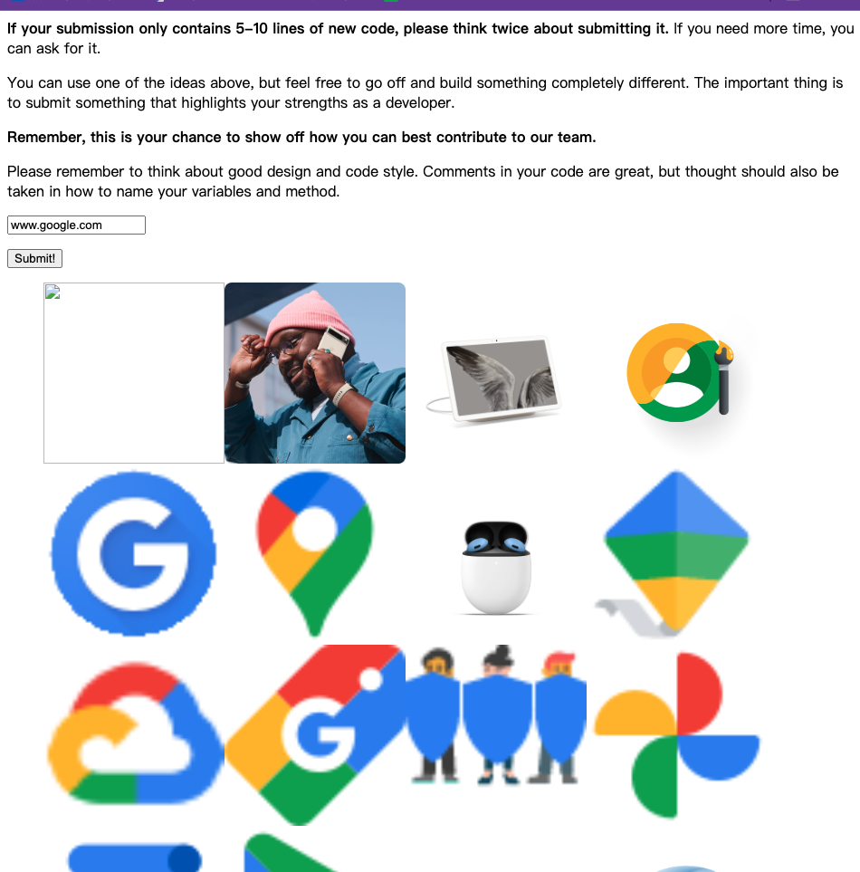
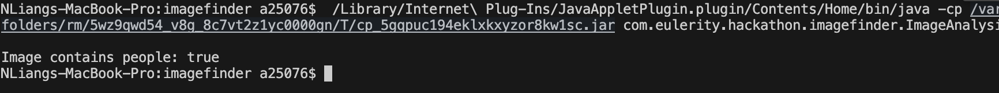

# Eulerity Hackathon Challenge
Congratulations on making it to this stage of Eulerity's interview process! In this folder is a project for a partially built web application whose goal is to crawl a provided URL and pick out the images from it. This README will provide more information about the goals of the project, its structure, and setup and submission instructions.

## ImageFinder Goal
The goal of this task is to perform a web crawl on a URL string provided by the user. From the crawl, you will need to parse out all of the images on that web page and return a JSON array of strings that represent the URLs of all images on the page. [Jsoup](https://jsoup.org/) is a great basic library for crawling and is already included as a maven dependency in this project, however you are welcome to use whatever library you would like.

### Required Functionality
We expect your submission to be able to achieve the following goals:
- Build a web crawler that can find all images on the web page(s) that it crawls.
- Crawl sub-pages to find more images.
- Implement multi-threading so that the crawl can be performed on multiple sub-pages at a time.
- Keep your crawl within the same domain as the input URL.
- Avoid re-crawling any pages that have already been visited.

### Extra Functionality
No individual point below is explicitly required, but we recommend trying to achieve some extra goals as well, such as the following:
- Make your crawler "friendly" - try not to get banned from the site by performing too many crawls.
- Try to detect what images might be considered logos.
- Show off your front-end dev skills with Javascript, HTML, and/or CSS to make the site look more engaging.
- Any other way you feel you can show off your strengths as a developer 😊

**PLEASE do not send us a submission with only a basic JSoup crawl and only a couple lines of code.** This is your chance to prove what you could contribute to our team.

You have one week to work on the submission from the time when you receive it. To submit you assignment, zip up your project (`imagefinder.zip`) and email it back to me. **Please include a list of URLs that you used to test in your submissions.** You should place them in the attached `test-links.txt` file found in the root of this project.

## Structure
The ImageFinder servlet is found in `src/main/java/com/eulerity/hackathon/imagefinder/ImageFinder.java`. This is the only provided Java class. Feel free to add more classes or packages as you see fit. 

The main landing page for this project can be found in `src/main/webapp/index.html`. This page contains more instructions and serves as the starting page for the web application. You may edit this page as much as it suits you, and/or add other pages. 

Finally, in the root directory of this project, you will find the `pom.xml`. This contains the project configuration details used by maven to build the project. If you want/need to use outside dependencies, you should add them to this file.

## Running the Project
Here we will detail how to setup and run this project so you may get started, as well as the requirements needed to do so.

### Requirements
Before beginning, make sure you have the following installed and ready to use
- Maven 3.5 or higher
- Java 8
  - Exact version, **NOT** Java 9+ - the build will fail with a newer version of Java

### Setup
To start, open a terminal window and navigate to wherever you unzipped to the root directory `imagefinder`. To build the project, run the command:

>`mvn package`

If all goes well you should see some lines that end with "BUILD SUCCESS". When you build your project, maven should build it in the `target` directory. To clear this, you may run the command:

>`mvn clean`

To run the project, use the following command to start the server:

```sh
#Important Update!
```

>`mvn jetty:run`


You should see a line at the bottom that says "Started Jetty Server". Now, if you enter `localhost:8080` into your browser, you should see the `index.html` welcome page! If all has gone well to this point, you're ready to begin!

## Submission
When you are finished working on the project, before zipping up and emailing back your submission, **PLEASE RUN ONE LAST `mvn clean` COMMAND TO REMOVE ANY UNNECESSARY FILES FROM YOUR SUBMISSION**. Please also make sure to add the URLs you used to test your project to the `test-links.txt` file. After doing these things, you may zip up the root directory (`imagefinder`) and email it back to us.

## Final Notes
- If you feel you need more time to work, you are free to ask for it.
- If you are having any trouble, especially with the setup, please reach out and we will try to answer as soon as we can.
- The ideas listed above on how to expand the project are great starting points, but feel free to add in your own ideas as well.
- Try to follow some good-practice principles when working on your code, such as meaningful and clean variable/method names and other good coding practices.
- The code we have provided is to allow you to hit the ground running. You are free to use whatever web service you would like (as long as you use Java 8 and it is runnable from the command line).
- We look forward to seeing what you can do, so good luck and have fun 😊


## Some ideas:
### Crawl not only the given url, but other pages in the same domain

Already support crawling other pages in the same domain by following links found on the initial page.

### Make your crawler multithreaded to speed up response times

Utilize Java's ExecutorService to manage a pool of threads for concurrent crawling. Each thread can handle crawling a different URL. Care must be taken to manage shared resources, like the list of visited URLs, to avoid concurrency issues.


### Be a friendly crawler and try not to hammer a site

Introduce a delay between requests to avoid hitting a server with too many requests in a short period. This can be as simple as adding a Thread.sleep() in your crawling loop or using more sophisticated scheduling with rate-limiting libraries.

```sh
try {
        Thread.sleep(REQUEST_DELAY_MS); // Wait for a specified delay before proceeding to the next request
    } catch (InterruptedException e) {
        Thread.currentThread().interrupt(); // Handle thread interruption
    }
```

### Think about how to identify different classes of images and do they need special handling

Analyzing Image URLs and Paths
Some websites organize their images in a way that the URL or the path to the image can give hints about its type.

Have a logoimage set to collect all logo images.
```java
if (imageElement.attr("alt").toLowerCase().contains("logo")) {
    // This might be a logo
}

```

Checks if an image URL contains a specific substring (e.g., /logos/) or if the alt text suggests it's a logo. If so, it calls a handleLogoImage method.

Since the crawler is multi-threaded, shared resources (like collections of URLs or images) are thread-safe by using ConcurrentHashMap.newKeySet() for both visitedUrls and images to ensure thread safety.

The awaitTermination method waits for all crawling tasks to complete before shutting down the executor, ensuring that the application gracefully handles all outstanding tasks.

### Can you identify images as logos? Perhaps collect favicons?


Collecting favicons, the small icons associated with websites, is a task that can also be accomplished with web scraping techniques, similar to image crawling but focusing on specific elements that denote the site's favicon. Favicons are often specified in the HTML <head> section with a <link> tag and a rel attribute that includes the word "icon". 


```java
// Inside the crawl method, after parsing the document
Elements faviconLinks = doc.head().select("link[href][rel=icon], link[href][rel='shortcut icon']");
for (Element link : faviconLinks) {
    String faviconUrl = link.attr("abs:href");
    if (!faviconUrl.isEmpty()) {
        // Add favicon URL to your collection of images or a separate favicon collection
    }
}

```
Can you mark images that contain people?

Use an Image Recognition API AWS Rekognition

Add a new button to trigger image analysis and modify the JavaScript to handle the button click event by sending an AJAX request with the image URLs to be analyzed. 

```html
<button type="button" id="analyzeButton">Analyze Images!</button>

<script>
    // Assume `images` holds your current image URLs to be analyzed
    var images = [];

    document.getElementById('analyzeButton').addEventListener("click", function(event) {
        event.preventDefault();
        if(images.length > 0) {
            makeApiCall('/analyzeImages', 'POST', {images: images}, function(response) {
                // Handle the analysis results here
                console.log(response);
            });
        }
    });

    // Adjust makeApiCall as needed to handle sending a JSON payload and receiving a response
</script>
```

Create a new servlet that will receive the image URLs, perform the analysis, and return the results. 

In the ImageAnalysis class, implement the containsPeople method to actually analyze the images. This could involve calling the Amazon Rekognition API.



